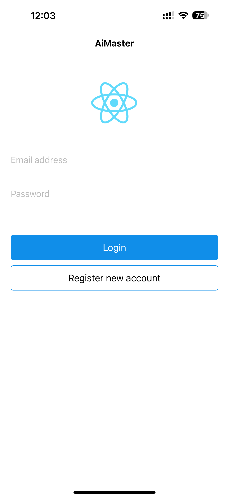
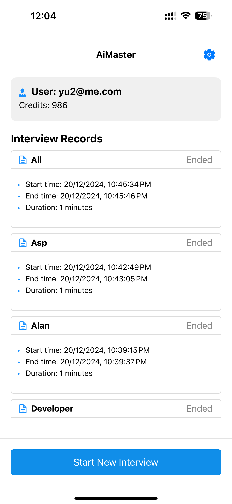
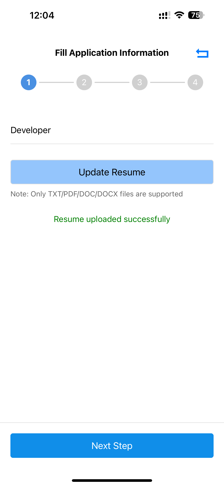
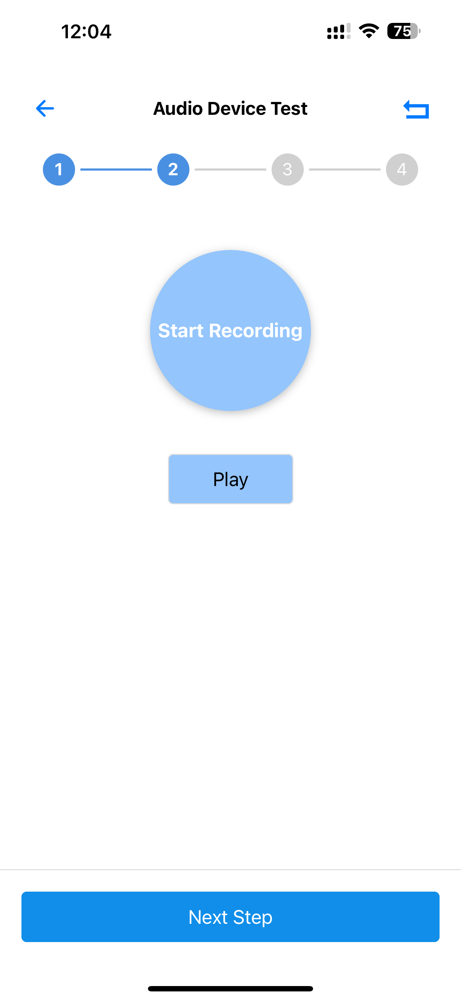
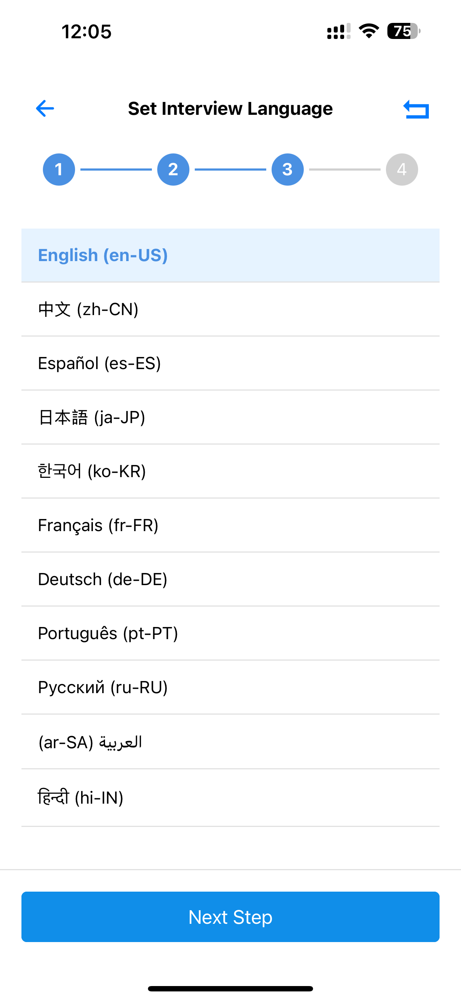
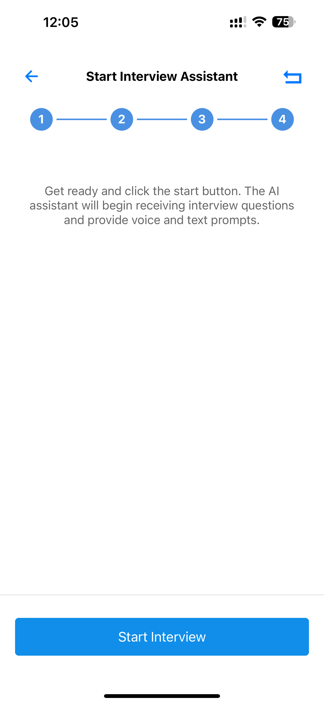

# AiPilot

## Description
AiPilot is a modern mobile application serving as the frontend component of the AiPilot platform. This React Native application works in conjunction with [AiPilot-AF](https://github.com/hhyyy9/AiPilot-AF), our Azure Functions-based backend, to provide an intelligent development assistant platform.

The platform combines the power of mobile accessibility with Azure's advanced AI and cloud services to deliver intelligent coding assistance and automated development workflows.

The application features a real-time voice assistance system for interviews, allowing users to wear headphones and receive instant AI-powered responses during interview sessions. This voice-guided interview support system helps users maintain natural conversation flow while receiving intelligent suggestions and guidance through audio feedback.

## Technology Stack
### Framework & Platform
- React Native (v0.74.5)
- Expo (v51.0.34)
- React (v18.2.0)

### Navigation & Routing
- Expo Router
- React Navigation (v6.1.18)

### State Management
- MobX (v6.13.3)
- MobX React Lite (v4.0.7)

### UI Components & Design
- Ant Design React Native (v5.2.3)
- Expo Vector Icons

### API & Network
- Axios (v1.7.7)
- OpenAI SDK (v4.65.0)

### Storage & Data
- AsyncStorage

### Internationalization
- i18next (v23.16.0)
- react-i18next (v15.0.3)

### Development & Build Tools
- TypeScript
- Babel
- Jest (testing)
- Expo Dev Client

### Native Features
- expo-av (Audio/Video)
- expo-document-picker
- expo-speech-recognition (Voice Recognition)
- react-native-tts (Text-to-Speech)
- expo-splash-screen
- expo-status-bar
- expo-web-browser

### Platform Support
- iOS
- Android

## Features
- 🎯 Intelligent Development Assistant
  - Code generation and completion
  - Natural language code conversion
  - Voice-to-code functionality
  - Real-time code suggestions

- 📱 Cross-Platform Support
  - iOS and Android native apps
  - Responsive design

- 🌍 Global Accessibility
  - Multi-language interface
  - Internationalization support
  - Voice command recognition

- 🔄 Seamless Integration
  - Connected to Azure backend services
  - Real-time synchronization
  - Secure authentication

## Screenshots
|  |  |  |
|:---:|:---:|:---:|
| Home Screen | Interview history | Upload resume |

|  |  |  |
|:---:|:---:|:---:|
| Speech Testing | Language selection | Start a interview |

|  |
|:---:|
| Ai Pilot |

## Prerequisites
- Node.js (v18.0.0 or higher)
- npm or yarn
- Expo CLI
- iOS Simulator (for iOS development)
- Android Studio (for Android development)

## Installation
```bash
# Clone the repository
git clone https://github.com/hhyyy9/AiPilot.git

# Navigate to project directory
cd AiPilot

# Install dependencies
npm install
# or
yarn install

# Start the development server
npx expo start
```

## Environment Setup
Create a `.env` file in the root directory:
```env
API_BASE_URL=your_backend_api_url
AUTH_CLIENT_ID=your_auth_client_id
```

## Project Structure
```
AiPilot/
├── app/                  # Main application screens
├── assets/              # Static assets
├── components/          # Reusable components
├── constants/           # Constants and configuration
├── hooks/              # Custom React hooks
├── navigation/         # Navigation configuration
├── services/          # API and backend services
├── store/             # MobX stores
├── types/             # TypeScript type definitions
└── utils/             # Utility functions
```

## Related Projects
- [AiPilot-AF](https://github.com/hhyyy9/AiPilot-AF) - Azure Functions backend providing AI and cloud services

## Contributing
1. Fork the repository
2. Create your feature branch (`git checkout -b feature/AmazingFeature`)
3. Commit your changes (`git commit -m 'Add some AmazingFeature'`)
4. Push to the branch (`git push origin feature/AmazingFeature`)
5. Open a Pull Request

## License
This project is licensed under the MIT License - see the [LICENSE](LICENSE) file for details.

## Acknowledgments
- Microsoft Azure Cloud Services
- OpenAI for AI capabilities
- Expo and React Native communities
- Contributors and supporters of the project